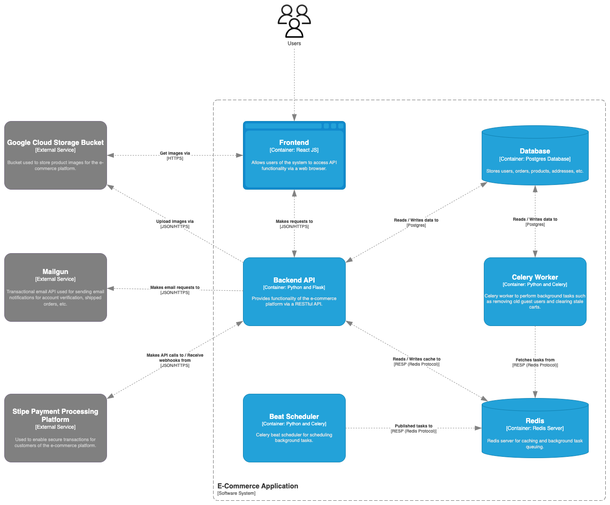
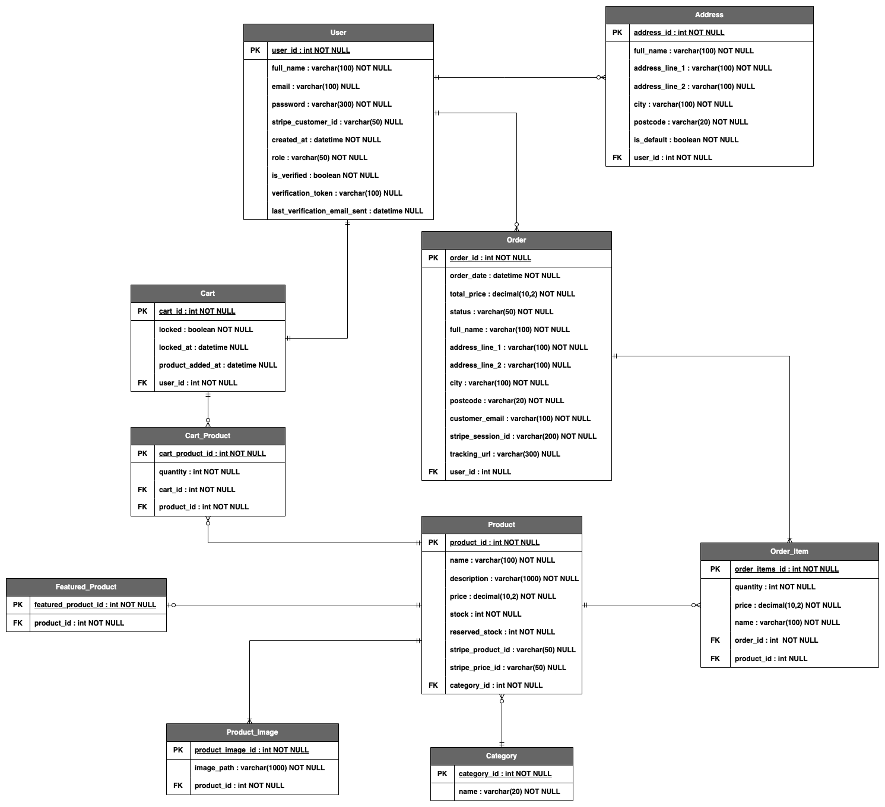
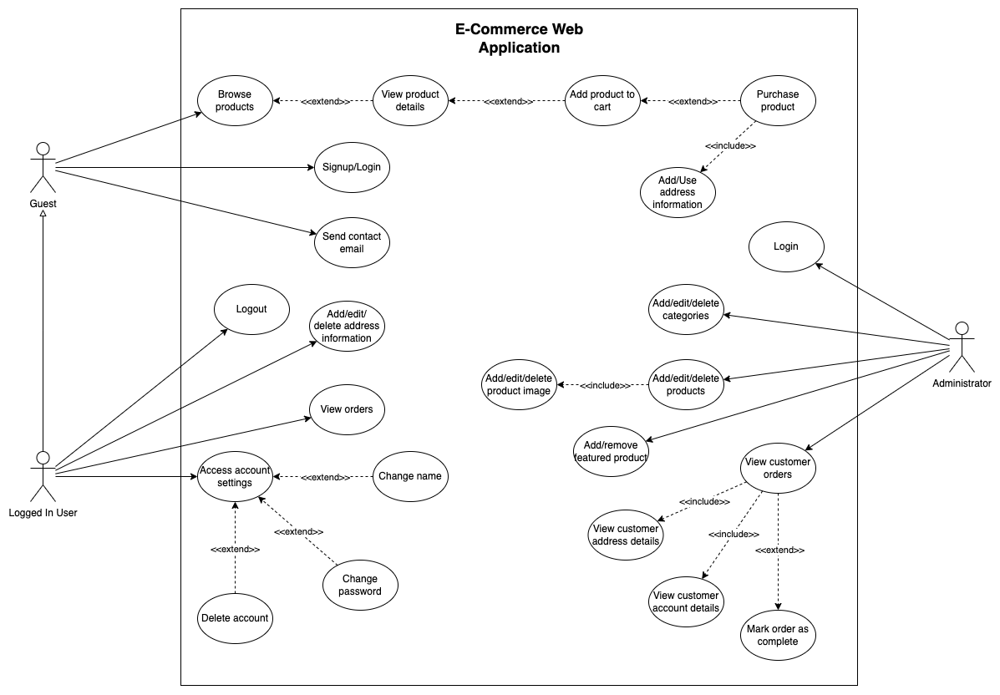

# 🛒 E-Commerce Web API


This is the backend RESTful API for an e-commerce platform built using **Flask** web framework, **PostgreSQL** for the database, **Redis** for background task management/caching, and **Celery** for task scheduling and execution. It integrates with **Stripe** for secure payment processing, **Google Cloud Storage Buckets** for storing product images, and **Mailgun** for transactional emails.

---

## 1. 🚀 Tech Stack

- **Python 3.12**
- **Flask** — Web framework
- **PostgreSQL** — Relational database
- **Redis** — Message broker and cache
- **Celery** — Background task processor
- **Celery Beat** — Background task scheduler
- **Google Cloud Storage** — Product image storage
- **Stripe API** — Payments integration
- **Mailgun** — Email notifications

---

## 2. 🏛️ System Architecture and Documentation

### 2.1. System Architecture Diagram


### 2.2. Entity Relationship Diagram


### 2.3. Use Case Diagram


---

## 3. 📦 Features

- **User Authentication**
  - Email verification during user registration via transactional email
  - JWT-based authentication using access and refresh tokens

- **Shopping Experience**
  - Product browsing and cart functionality
  - Secure checkout flow via Stripe
  - Order history with order detail and status tracking (processing, shipped, delivered)
  - Address management for shipping

- **Admin Panel**
  - Admin dashboard for managing products, categories, orders, and users
  - Full CRUD capabilities for products and categories
  - Order status updates and user account visibility

- **System & Deployment**
  - Environment-based configuration using `FLASK_ENV` (development, production, testing)
  - Dockerised with `Dockerfile` and `entrypoint.sh` for streamlined deployment
  - Database migrations handled with SQLAlchemy and Flask-Migrate

- **Testing**
  - Full API test coverage using `pytest`

- **Other**
  - Contact form for user-to-admin communication
  - Modular RESTful architecture
  
---

## 4. 🛠️ Deployment

### 4.1. 🔐 Environment Variables

Create a `.env` file in the project root with the required keys.  
See [`docs/env.example`](docs/env.example) for a template.

Also, place your Google Cloud service account credentials file (e.g. `service-account-file.json`) in the project root.  
This is required for uploading and modifying files in your Google Cloud Storage bucket.

##

### 4.2. 🖥️ CLI Setup

#### 4.2.1. Clone the repo
```bash
git clone https://github.com/joehall02/ECommerceWebAPI.git
cd ECommerceWebAPI
```

#### 4.2.2. Set up virtual environment
```bash
python -m venv venv
source venv/bin/activate
```

#### 4.2.3. Install dependencies
```bash
pip install -r requirements.txt
```

#### 4.2.4. Run database migrations
```bash
flask db upgrade
```

#### 4.2.5. Start the application

##### 4.2.5.1. Run the API
```bash
python run.py
```

##### 4.2.5.2. Run Celery worker
```bash
celery -A celery_worker.celery worker --loglevel=info --concurrency=1
```

##### 4.2.5.3. Run Celery beat
```bash
celery -A celery_worker.celery beat --scheduler redbeat.RedBeatScheduler
```

##

### 4.3. 🐳 Docker Setup

You can run the application as a standalone docker container using the provided `Dockerfile`.

#### 4.3.1. Clone the repo
```bash
git clone https://github.com/joehall02/ECommerceWebAPI.git
cd ECommerceWebAPI
```

#### 4.3.2. Build the Docker image 
```bash
docker build -t image-name .
```

#### 4.3.3. Run the container
```bash
docker run \
--name ecommerce-api \
--env-file .env \
-e SERVICE_ROLE=backend \
-p host-port:container-port ecommerce-webapi
```
##### 📌 Tip: Change `SERVICE_ROLE` depending on the required role (backend, celery or beat)

---

## 5. 🧪 Running Unit Tests

To run the full backend test suite:

```bash
python run_tests.py
```

---

## 6. 🔗 Related Projects

- [ECommerceFrontend](https://github.com/joehall02/ECommerceFrontend)

---

## 7. 📄 Licence

This project is licensed under the [MIT Licence](LICENCE).

